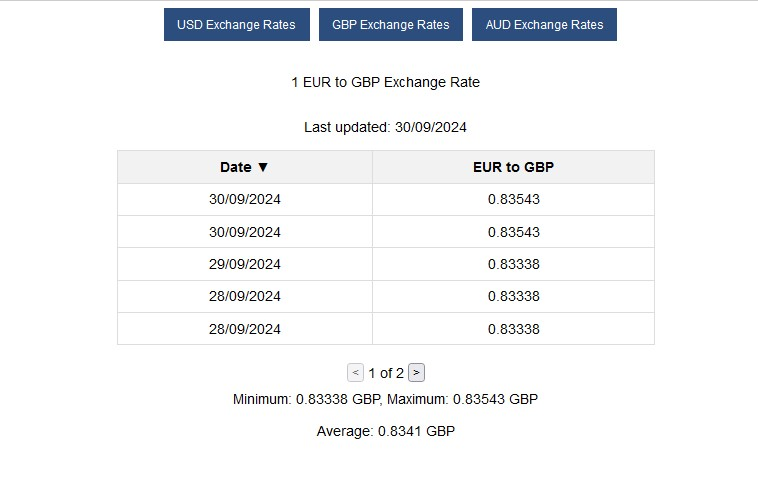

# Currency exchange rate app




## Steps to launch the app:

### Vue setup:
```bash
cd vue
npm install
npm run start
```

### nodejs setup:
```bash
cd node
npm install
npm run start
```

### .env setup
```text
API_KEY=<KEY FROM https://anyapi.io/api/v1/>
PORT=3000
ANYAPI=https://anyapi.io/api/v1

DB_HOST=localhost
DB_USER=user
DB_PASSWORD=password
DB_NAME=currency_exchange
```

### DB setup:
Create mysql DB called: `currency_exchange`